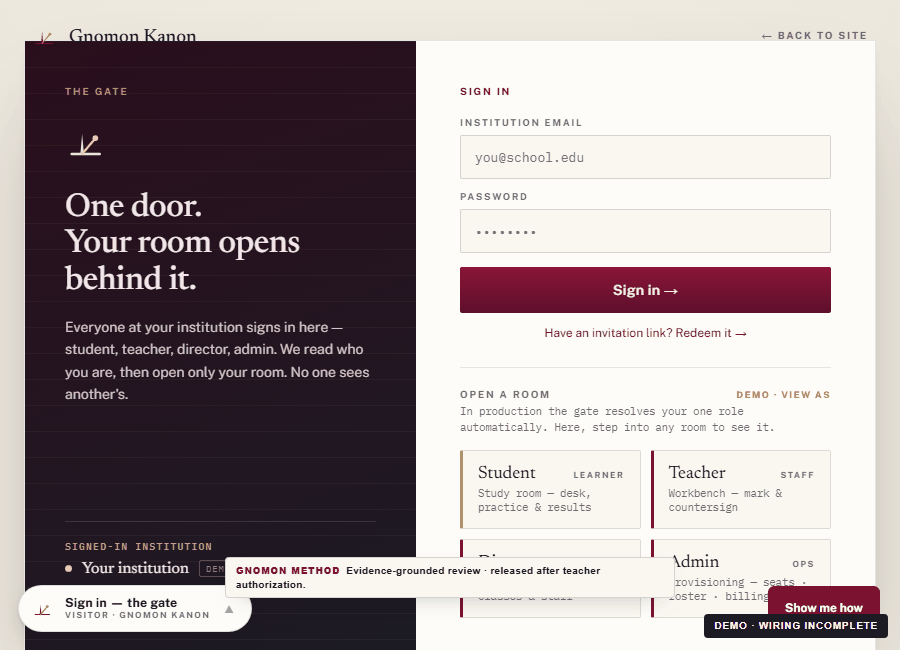

# Minh Vo

*Vo Ba Hoang Minh*

**AI Evaluation Engineer | Data pipelines, multimodal fine-tuning and inspectable AI systems**

[Portfolio website](https://anhminhzui-dev.github.io/anhminhzui-dev/) · [CV (PDF)](Vo_Ba_Hoang_Minh_CV.pdf) · [Research paper (PDF)](papers/2026-09-gnomon-ielts-feedback-engine-technical-report.pdf) · [Engineering write-up](writeups/2026-09-07-destructive-git-refusal-gate.md)

**Explore:** [Projects](#seven-focused-tools) · [Gnomon research](#research-constructing-evidence-grounded-language-judgments) · [Contributions](#contributions-and-work-in-progress) · [Creative portfolio](https://minh_hoang.artstation.com/) · [Contact](#contact)

Based in Ho Chi Minh City, Vietnam · Available for international remote roles and HCMC onsite/hybrid work

I turn vague model-quality requirements into reproducible checks, traceable data and specific failure cases.

I founded Gnomon, a writing-assessment research project, and direct its architecture, evaluation design and acceptance review. Claude and Codex assist implementation. My focus is the engineering behind a result: what evidence supports it, where it can fail and how another developer can check it.

Start with **failclosed-eval** for evaluation infrastructure or **policy-deck** for measured agent guardrails. All seven repositories below are source-available under evaluation-only licences, with runnable examples and a defined integration scope.

### Two places to start

- **[failclosed-eval](https://github.com/anhminhzui-dev/failclosed-eval): input admission and traceable evaluation.** Inspect payload requirements, named refusals, partial denominators and a runnable public-data example.
- **[policy-deck](https://github.com/anhminhzui-dev/policy-deck): measured command-policy classification.** Reproduce fitted/separate-deck results, then inspect regressions that deliberately reintroduce broken rules.

### Seven focused tools

| Project | Demonstrated engineering | Recorded tests |
|---|---|---:|
| [failclosed-eval](https://github.com/anhminhzui-dev/failclosed-eval) | Input admission, traceability and negative cases. Public-data example: 375 admitted / 125 deliberately malformed records refused out of 500. | 239 |
| [policy-deck](https://github.com/anhminhzui-dev/policy-deck) | Pinned command-policy decks and error budgets: 8 FP / 0 FN on 1,260 fitted rows; 2 / 0 on 190 separate rows. | 455 |
| [rollout-sentinel](https://github.com/anhminhzui-dev/rollout-sentinel) | Detect specified failure signals in agent rollouts; malformed failure counts abstain. | 28 |
| [mcp-trajectory-judge](https://github.com/anhminhzui-dev/mcp-trajectory-judge) | Replay tool trajectories against declared contracts in a toy sandbox. | 20 |
| [release-gate](https://github.com/anhminhzui-dev/release-gate) | Validate synthetic rubric rows and gate on a resampled lower bound. | 14 |
| [real-token-meter](https://github.com/anhminhzui-dev/real-token-meter) | Account for non-padding tokens, throughput and cost; reject invalid log rows. | 26 |
| [model-error-translator](https://github.com/anhminhzui-dev/model-error-translator) | Translate specified model failures into actionable messages without inventing retry or completion guarantees. | 18 |

Test counts are the 7 September 2026 checked-commit snapshot, not a hiring score. The policy decks are synthetic and partly rule-aware; classifier performance is not sandbox security. The public-data admission example measures validation, not model accuracy, and keeps the essay corpus outside Git.

### Research: constructing evidence-grounded language judgments

Gnomon is a connected assessment-research system: the data layer selects usable material, a compiled rubric defines what to inspect, models propose observations, and verification and scoring construct a traceable result. The work includes the infrastructure around that chain—not just the final prompt.

| Engineering area | What the implementation actually does |
|---|---|
| **Corpus and data contracts** | Source/task/role-aware selection, held-out exclusion, quarantine checks, image admission, 44 registered quality checks, staged practice pools and mutation lineage. |
| **Compiled assessment knowledge** | Validated rubric specifications become a content-versioned runtime bank, shared by prompt construction and scoring, with dimensions, graded groups and task overlays. |
| **Evidence identity** | Resolves permitted short anchors to exact response spans; validates relation endpoints and memberships; retains multiple item views without duplicate scoring credit. |
| **Constrained judgement** | Shared item verification and scoring, missing-evidence states, limiting dimensions, caps, scale transformations and abstention; optional calibration and correction branches. |
| **Correction-data engineering** | Selects verifier-passing attempts, binds critiques to candidates and repairs, requires positive reward change and preserves first-pass anchors before forming new SFT targets. |
| **Measurement research** | Conditional PCM/normalised trait targets, ranking-aware loss, gated Rasch/graded-response calibration and source/scale diagnostics. |
| **Training systems** | Completion-focused weighting, alternative curriculum/length-group ordering, chunked vocabulary-loss computation and separate input/non-padding/target-token accounting. |
| **Human operation** | Teacher review, release, learner access and challenge interfaces; learner-facing communication is evaluated separately from internal evidence mechanics. |

The development record includes **101,175 corpus records across 47 source labels**, **11,466 prepared training/validation records**, and a separate earlier **8B multimodal fine-tuning run on 9,325 examples**, including **2,134 image-bearing examples**. These are distinct, overlapping asset and run populations—not an aggregate evaluation count.

Earlier encoder work also includes configurable ModernBERT low-rank adapters, weight merging and a DirectML-compatible optimiser. The report distinguishes those historical implementations from the current extraction path.

**[Constructing Language Judgments: Rubric Distillation and Evidence-Grounded Reasoning](papers/2026-09-gnomon-ielts-feedback-engine-technical-report.pdf)** connects compiled rubrics, structured reasoning supervision, evidence-verifying execution harnesses and resource-aware multimodal adaptation. Five vector figures, an executed scoring replay and scoped historical observations explain how judgments are constructed from verified observations. IELTS is the implemented application. This is an independent systems report, revision 14, not peer reviewed; current-engine accuracy and cross-domain transfer require separate evaluation. Private datasets, prompts and scoring recipes are not published.

### Demo

Recorded interface walkthrough with synthetic content and demo identities, illustrating report presentation and release wiring. Teaching quality and live operational validation are separate evaluations.

### How I work

**Start with a failure.** Make the unwanted behavior reproducible before proposing a repair.

**Expose the measurement.** Publish the example, denominator, result and limitation together.

**Keep the comparison simple.** Check that a fix closes the failure without breaking valid behavior.

**Make the work inspectable.** In policy-deck and rollout-sentinel, deck pins prevent silent reference changes; the other tools record hashes for traceability rather than claiming the same enforcement.

### Papers and write-ups

- Technical report, September 2026: [Constructing Language Judgments: Rubric Distillation and Evidence-Grounded Reasoning](papers/2026-09-gnomon-ielts-feedback-engine-technical-report.pdf). Rubric compilation, structured supervision, evidence identity, judgment construction and training systems.
- Write-up: [A destructive-git refusal gate built from a live incident](writeups/2026-09-07-destructive-git-refusal-gate.md).

### Contributions and work in progress

- **[EleutherAI lm-evaluation-harness: DummyLM tests](https://github.com/EleutherAI/lm-evaluation-harness/pull/4115)** — submitted upstream contribution; open and not merged as of 8 September 2026. The pull request exposes the proposed tests and review history.
- **[RelayGate](https://github.com/anhminhzui-dev/relay-gate)** — hackathon project in progress: a local command-policy demo with mock escalation. Code is public; a completed submission, live-provider demonstration and judging result are not yet recorded.

### Reproduction and scope

The seven tools are independent engineering samples with synthetic fixtures; the separate public-corpus example requires externally obtained data. Reproduction commands and integration limits are documented per project. Evaluation-only licences are source-available, not open-source licences.

### Contact

Email: minhhoang250803@gmail.com

